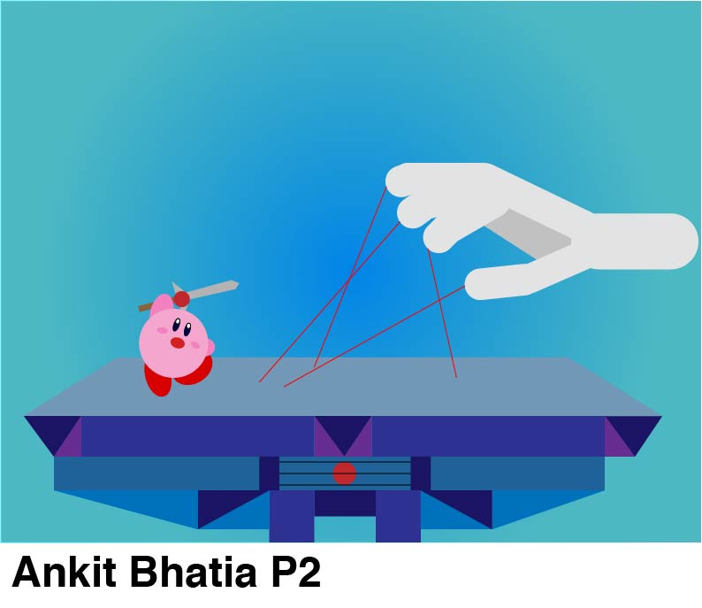
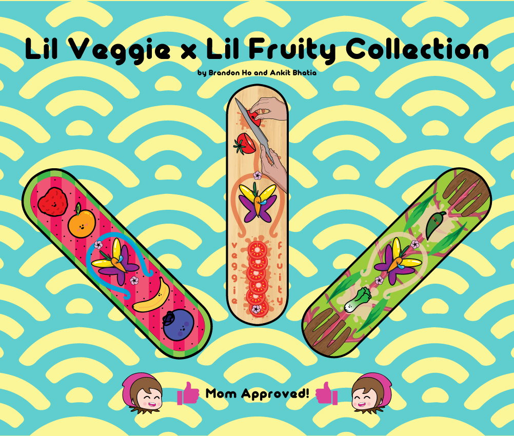

Throughout my first graphic design class in high school, I have been creating artwork using Illustrator and will later be learning InDesign to add to my collection. Here's what I've got so far!

I took inspiration for this from the first video game I fully finished: Super Smash Bros: Brawl on the Nintendo Wii. This scene shows Kirby fighting the Master Hand, who was the final boss in the story mode. This image was made using only simple shapes such as circles, rectangles, and triangles.

This project was a conjoined effort between my partner Brandon Ho and I. We based these skateboard designs around the idea of healthy foods. The left board has many fruits in them, and the right board has vegetables. These are both integrated into the middle board where a healthy salad is being made.
